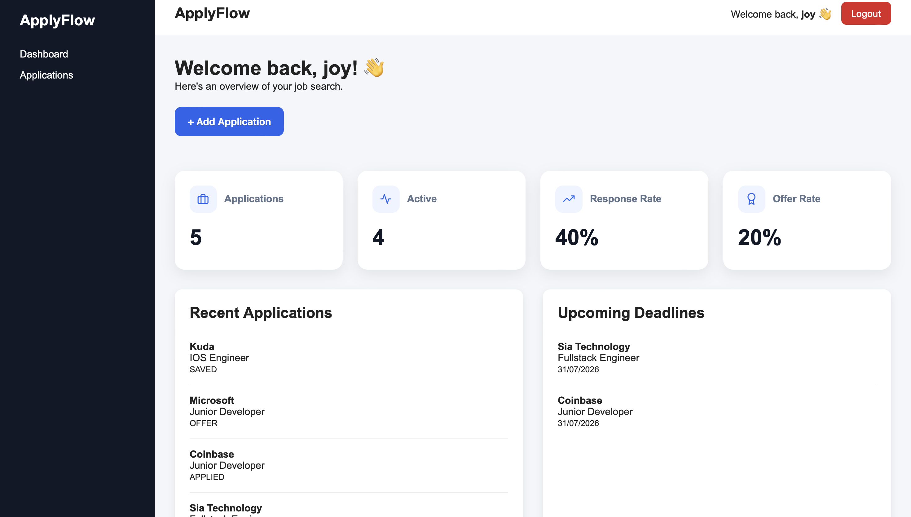
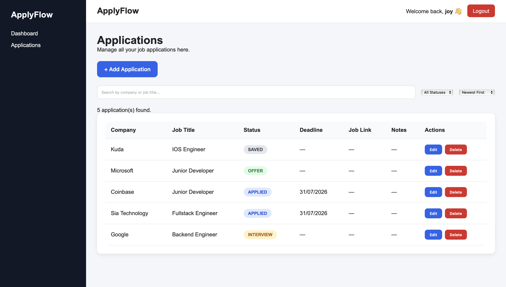
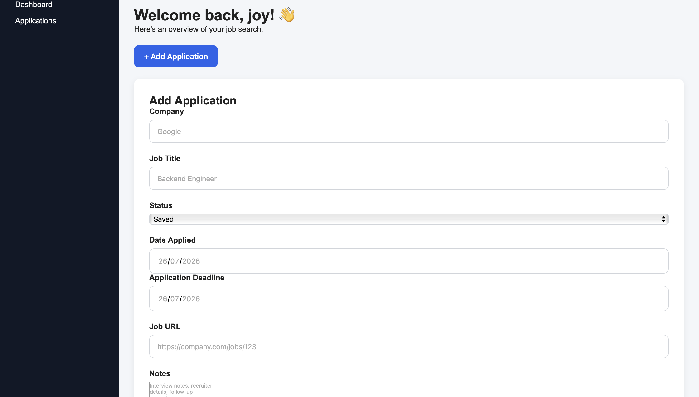
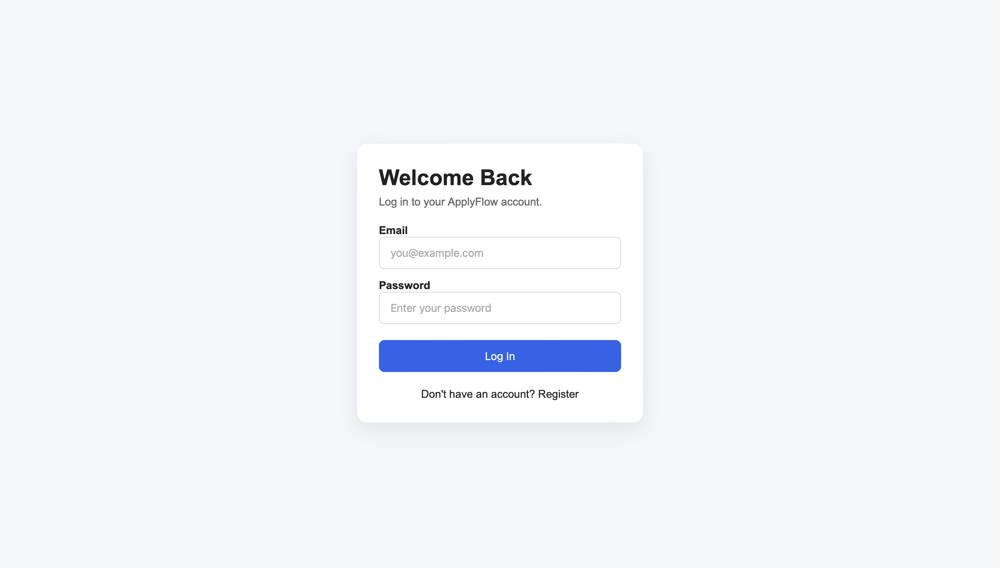
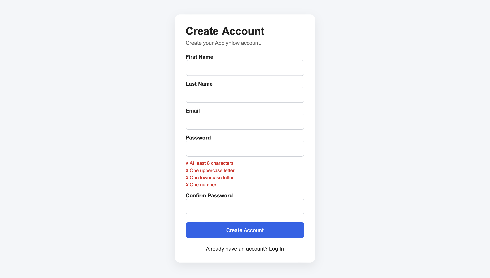

# 🚀 ApplyFlow


A full-stack job application tracking platform built with **React, Express.js, PostgreSQL, and Prisma** that helps job seekers organize applications, monitor progress, manage deadlines, and manage their job search through an interactive dashboard.

This project demonstrates modern full-stack development practices including secure JWT authentication, RESTful APIs, database design with Prisma ORM, responsive UI development, and cloud deployment using Railway and Vercel.


# 🌐 Live Demo

## 🌐 Live Demo

**Frontend**

👉 https://applyflow-swart.vercel.app

**Backend API**

👉 https://applyflow-production-34d3.up.railway.app


# 📸 Screenshots

> Screenshots from the live application.

## 📊 Dashboard



---

## 💼 Applications



---

## ➕ Add Application



---

## 🔐 Login



---

## 📝 Register




# 🚀 Key Features

- 🔐 Secure JWT Authentication
- 👤 User Registration & Login
- 🛡️ Protected Routes
- 📊 Interactive Dashboard
- 📈 Real-time Application Statistics
- ➕ Create Job Applications
- ✏️ Edit Existing Applications
- 🗑️ Delete Applications
- 🔍 Search by Company or Job Title
- 🎯 Filter by Application Status
- ↕️ Sort Applications
- 📅 Upcoming Deadline Tracking
- 📝 Personal Notes
- 🔗 Save Job Posting URLs
- 🔔 Toast Notifications
- 📱 Responsive Interface
- ☁️ Deployed on Vercel & Railway


# 🛠 Tech Stack

## Frontend

- React
- Vite
- React Router
- Axios
- React Hot Toast

## Backend

- Node.js
- Express.js
- Prisma ORM
- JWT Authentication
- Zod Validation

## Database

- PostgreSQL

## Deployment

- Vercel
- Railway


# 🏗️ Architecture

                Client

        React + Vite
             │
        Axios HTTP
             │
             ▼
     Express REST API
             │
      JWT Authentication
             │
             ▼
        Prisma ORM
             │
             ▼
        PostgreSQL


# 📂 Project Structure

ApplyFlow
│
├── client
│   ├── src
│   ├── public
│   └── package.json
│
├── server
│   ├── prisma
│   ├── src
│   └── package.json
│
└── README.md
```


# ⚙️ Installation

## Clone the repository

```bash
git clone https://github.com/jaiy3/applyflow.git
```

## Install dependencies

### Frontend

```bash
cd client
npm install
```

### Backend

```bash
cd server
npm install
```


# 🔑 Environment Variables

## Backend (`server/.env`)

```env
DATABASE_URL=
JWT_SECRET=
```

## Frontend (`client/.env`)

```env
VITE_API_URL=
```


# ▶️ Run Locally

## Start the backend

```bash
cd server
npm run dev
```

## Start the frontend

```bash
cd client
npm run dev
```


# 🎯 Future Improvements

- Company Logos
- Kanban Board
- Calendar View
- Email Notifications
- Analytics Charts
- Dark Mode
- Resume Uploads
- AI Resume Matching
- Interview Scheduler


# 👨‍💻 Author

**Jaiye Adeboye**

GitHub: https://github.com/jaiy3

LinkedIn: _(Coming Soon)_


# 📄 License

This project is licensed under the MIT License.